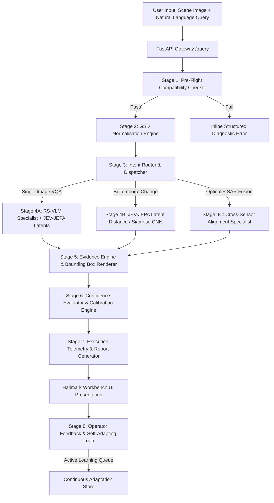

# SatQuery AI — Product Requirements Document (PRD)

**Project:** SatQuery AI — Remote Sensing Telemetry Workbench  
**Team:** Parallax | SIH 2026 — Problem Statement 26167  
**Version:** 2.0 (Prototype Specification)  
**Status:** Active Development  

---

## 1. Executive Summary & Vision

SatQuery AI is an intelligent visual question answering (VQA) and spatial reasoning platform engineered specifically for Earth Observation (EO) and satellite imagery. Traditional GIS workflows require deep domain knowledge, manual sensor calibration, complex multi-band combinations, and fragmented software suites. 

SatQuery AI enables operators, analysts, and decision-makers to upload raw or pre-processed satellite imagery (multi-spectral, optical, SAR), ask natural-language questions, and receive:
1. **Grounded, factual answers** with verified physical reasoning.
2. **GSD-calibrated visual evidence overlays** (bounding boxes, segmentation contours, change masks).
3. **Calibrated confidence scores** and a transparent, step-by-step **observable execution trace**.
4. **Continuous adaptation** through a closed-loop human-in-the-loop feedback mechanism.

The system replaces black-box hallucinations with deterministic pre-flight checks, Ground Sampling Distance (GSD) spatial normalization, non-generative Joint Earth-Video/Embedding Predictive Architecture (JEV-JEPA) representations, and fine-tuned specialist Vision-Language Models (RS-VLMs).

---

## 2. Core Novelty Pillars

```
┌─────────────────────────────────────────────────────────────────────────────────────────────┐
│                                   SATQUERY NOVELTY ARCHITECTURE                             │
└─────────────────────────────────────────────────────────────────────────────────────────────┘
      │
      ▼
┌─────────────────────────┐     ┌─────────────────────────┐     ┌─────────────────────────┐
│   GSD NORMALISATION     │ ──► │        JEV-JEPA         │ ──► │  FINE-TUNED RS-VLM &    │
│ (Madhura & Dipesh)      │     │    (Khushal & Aryan)    │     │   SELF-ADAPTING LOOP    │
│ Scale-invariance across │     │ Latent spatial-temporal │     │   (Aakansha & Mannat)   │
│ Sentinel, Landsat, Planet│    │ EO representation       │     │ Active learning & calib │
└─────────────────────────┘     └─────────────────────────┘     └─────────────────────────┘
      │                                       │                              │
      └───────────────────────────────────────┼──────────────────────────────┘
                                              ▼
                               ┌─────────────────────────────┐
                               │   HALLMARK TELEMETRY UI     │
                               │           (Aryan)           │
                               │ Tactile, high-contrast,     │
                               │ observable execution engine │
                               └─────────────────────────────┘
```

1. **Deterministic Pre-flight & GSD Normalisation**: Automated spatial resolution detection and resampling to eliminate cross-sensor scale distortion (e.g., comparing 10m Sentinel-2 with 3m PlanetScope or 0.5m WorldView).
2. **JEV-JEPA Latent Representation**: Joint Earth-Video / Embedding Predictive Architecture for self-supervised spatio-temporal representation learning. Non-generative feature extraction ensures fast, hallucination-free spatial encodings and bi-temporal change detection in latent space.
3. **Observable Execution Trace & Confidence Arbitration**: Every pipeline stage (`Compatibility` → `GSD Normalization` → `JEPA Representation` → `Specialist Reasoning` → `Evidence Grounding`) emits structured telemetry with millisecond timing and verifiable diagnostics.
4. **Continuous Self-Adapting Loop**: Active learning queue and dynamic parameter adaptation triggered by operator feedback, confidence thresholding, and grounding uncertainty.
5. **Hallmark Industrial Telemetry Interface**: Anti-AI-slop design system built for professional geospatial analysts—prioritizing density, high contrast, tactile feedback, and crisp telemetry over generic decorative landing page templates.

---

## 3. Team Workstreams & Feature Ownership

| Workstream | Lead Engineers | Scope & Deliverables |
|---|---|---|
| **JEV-JEPA Engine** | **Khushal & Aryan** | • Joint Earth-Video / Embedding Predictive Architecture adaptation for EO.<br>• Spatial patch masking and latent predictor architecture.<br>• Bi-temporal change detection and representation similarity metrics.<br>• Integration with the backend specialist engine (`backend/specialists.py`, `backend/dl_models.py`). |
| **UI / UX & Hallmark Frontend** | **Aryan** | • Hallmark-compliant anti-AI-slop frontend architecture.<br>• Strict adherence to all 20 negative UI parameters (no purple/blue gradients, no untouched shadcn, etc.).<br>• Dual-canvas geospatial viewer, multi-modal evidence inspector, and 8-state interactive components.<br>• Live observable execution drawer and calibrated telemetry visualizer. |
| **GSD Normalisation Engine** | **Madhura & Dipesh** | • Metadata extraction for multi-sensor GeoTIFF/raster files (GSD, bounding coordinates, projection).<br>• Multi-sensor spatial resolution normalization (resampling, anti-aliased spatial decimation).<br>• Metric physical scale bar rendering and physical coordinate transformation.<br>• Input resolution validation in compatibility checker (`backend/compatibility.py`). |
| **Fine-Tuning & Self-Adapting Loop** | **Aakansha & Mannat** | • QLoRA instruction fine-tuning on BigEarthNet / Remote Sensing VQA datasets.<br>• High-uncertainty sample filtering and active learning candidate queue.<br>• Human-in-the-loop feedback logging and dynamic adapter weighting.<br>• Expected Calibration Error (ECE) monitoring and confidence arbitration. |

---

## 4. System Architecture & End-to-End Pipeline Flow



### Pipeline Details

1. **Pre-flight Compatibility Validation (`compatibility.py`)**:
   - Validates file integrity, decodability, MIME type (`.tif`, `.tiff`, `.jpg`, `.png`), and band counts.
   - Verifies scene count matches query intent (e.g., query mentioning "difference" or "changed" requires $N \ge 2$ scenes).
   - Validates embedded geospatial tags (CRS, transform matrix) when GeoTIFF is supplied.

2. **GSD Normalisation Engine (`gsd_normalizer.py`)**:
   - Detects or infers Ground Sampling Distance (meters per pixel):
     - Sentinel-2: 10m (RGB/NIR), 20m (RedEdge/SWIR), 60m (Atmospheric).
     - Landsat 8/9: 15m (Panchromatic), 30m (Multispectral).
     - PlanetScope: ~3.0m.
     - WorldView / Aerial: 0.3m – 0.5m.
   - Normalizes input imagery to standard canonical working resolutions ($512 \times 512$ or $1024 \times 1024$) while preserving spatial scale metadata.
   - Computes physical scale factor to ensure bounding boxes and area estimates reflect real-world metric dimensions ($m^2$ or $km^2$).

3. **JEV-JEPA Latent Representation (`dl_models.py` & `jepa_engine.py`)**:
   - Non-generative self-supervised encoder.
   - Processes spatial patches via Vision Transformer (ViT) backbone without reconstructing RGB pixels.
   - Computes latent patch embeddings and predicts masked target representations in feature space.
   - For bi-temporal queries, computes embedding cosine distance matrix across aligned spatial patches to detect semantic ground changes (construction, deforestation, water receding).

4. **Specialist Reasoning & Fine-Tuned RS-VLM (`specialists.py`)**:
   - Multi-tiered fallback execution chain:
     - **Tier 1**: Fine-tuned RS-VLM LoRA checkpoint (local/remote inference).
     - **Tier 2**: High-throughput Multimodal Vision API (Gemini 2.5 Flash / Groq Vision).
     - **Tier 3**: Context-augmented GeoSpatial heuristic engine.
     - **Tier 4**: Offline deterministic mock for air-gapped demo safety.

5. **Evidence Grounding Engine (`evidence.py`)**:
   - Translates model bounding coordinates (normalized $0-1000$ or percentage $[0, 100]$) into high-resolution spatial overlays.
   - Renders crisp, color-calibrated bounding boxes, label pills, polygon contours, and physical metric scale bars.

6. **Confidence Calibration & Arbitration (`confidence.py`)**:
   - Computes compound confidence score:
     $$C = w_1 \cdot P_{\text{token}} + w_2 \cdot S_{\text{grounding}} + w_3 \cdot M_{\text{gsd\_compat}}$$
   - Classifies result into `High` ($> 0.82$), `Medium` ($0.55 - 0.82$), or `Low` ($< 0.55$).

7. **Self-Adapting Feedback Loop (`feedback.py`)**:
   - Records query-image-result tuples along with operator ratings (Accept / Reject / Corrected Bounding Box).
   - Flags low-confidence or high-entropy queries for active learning triage.
   - Updates prompt context cache and queues candidates for scheduled LoRA fine-tuning rounds.

---

## 5. API Contracts & Endpoints

### 5.1 Pre-Flight Compatibility Check
```http
POST /compatibility-check
Content-Type: multipart/form-data

Parameters:
  images: File[] (1 to 2 image files)
  query: string

Response (200 OK):
{
  "valid": true,
  "reason": null,
  "detected_intent": "single_image_vqa",
  "gsd_metadata": {
    "detected_gsd_m": 10.0,
    "sensor_family": "Sentinel-2",
    "normalization_applied": "bicubic_anti_aliased_downsample"
  }
}
```

### 5.2 Query Execution Pipeline
```http
POST /query
Content-Type: multipart/form-data

Parameters:
  images: File[] (1 to 2 image files)
  query: string
  target_gsd: float (optional, meters/pixel)

Response (200 OK):
{
  "error": false,
  "answer": "A total of 4 cargo vessels are docked along the eastern quay.",
  "confidence": {
    "label": "High",
    "score": 0.89,
    "calibration_tier": "calibrated_token_grounding"
  },
  "evidence": {
    "type": "bbox",
    "overlay_image_url": "/static/overlays/evidence_8f1a2c.png",
    "bounding_boxes": [[12.4, 45.1, 28.6, 68.3]],
    "physical_scale": "1 px = 10.0 m | Total highlighted area ≈ 14,200 m²"
  },
  "trace": [
    {"stage": "Compatibility Check", "status": "ok", "duration_ms": 14, "detail": "Valid GeoTIFF RGB format"},
    {"stage": "GSD Normalisation", "status": "ok", "duration_ms": 28, "detail": "Normalized 10m Sentinel-2 to 512x512 grid"},
    {"stage": "JEV-JEPA Feature Extraction", "status": "ok", "duration_ms": 82, "detail": "Latent patch embeddings generated (d=768)"},
    {"stage": "RS-VLM Inference", "status": "ok", "duration_ms": 420, "detail": "Specialist detected 4 vessels with grounding tags"},
    {"stage": "Evidence Rendering", "status": "ok", "duration_ms": 35, "detail": "Rendered high-contrast bounding overlays"}
  ],
  "report_url": "/report/8f1a2c",
  "report_id": "8f1a2c"
}
```

### 5.3 Operator Feedback & Self-Adapting Ingestion
```http
POST /feedback
Content-Type: application/json

Payload:
{
  "query_id": "8f1a2c",
  "rating": "accept" | "reject" | "corrected",
  "corrected_answer": "5 vessels docked (1 partially obscured by cloud shadow)",
  "corrected_bbox": [[12.0, 44.5, 30.0, 72.0]],
  "operator_notes": "Missed small patrol boat near northern pier"
}

Response (200 OK):
{
  "status": "logged",
  "active_learning_queued": true,
  "sample_entropy": 0.76
}
```

### 5.4 Report Retrieval
```http
GET /report/{report_id}?format={json|pdf|md}
Response: Direct file stream or structured JSON
```

---

## 6. Non-Goals & Scope Boundaries (Prototype vs. Production)

| Feature | Prototype Scope (This Build) | Production Roadmap (Post-SIH) |
|---|---|---|
| **Multi-Sensor Data** | Curated GeoTIFF, PNG, JPG representing Sentinel-2, Landsat, SAR. | Native direct STAC catalog API integration (Copernicus, USGS, Planet APIs). |
| **Authentication** | Session-based local storage, no user auth required. | Multi-tenant RBAC, OAuth2, clearance-level dataset access. |
| **Deployment** | Localhost execution + Cloudflare/ngrok tunnel for evaluator demo. | Kubernetes cluster with distributed GPU nodes & Triton inference server. |
| **GSD Range** | Normalizes $0.3\text{m} - 60\text{m}$ to canonical $512\text{px}$ / $1024\text{px}$ working canvas. | Full-scene multi-gigabyte GDAL pyramid tiling with dynamic web-map service. |
| **Continuous Learning** | In-memory feedback logging + local dataset candidate queuing. | Automated CI/CD retraining pipeline with synthetic hard-negative mining. |

---

## 7. Success Criteria & Evaluation Metrics

1. **Reliability on Golden Demo Set**: 100% pass rate across 5 rehearsed satellite scenes (Airport, Port, Agricultural, Urban, SAR).
2. **GSD Invariance**: System accurately answers queries on both 10m Sentinel-2 and 0.5m High-Res imagery without hallucinating scale.
3. **Execution Trace Visibility**: Complete execution trace with 5+ stages rendered within $< 1500\text{ms}$ on GPU ($< 3500\text{ms}$ on CPU).
4. **Observable Error Handling**: Compatibility checker catches mismatched queries (e.g., 1 image supplied for change detection) in $< 50\text{ms}$ with specific actionable feedback.
5. **Hallmark UI Compliance**: Zero presence of the 20 banned UI patterns; passed Hallmark anti-slop audit across viewport sizes ($320\text{px} - 1440\text{px}$).
