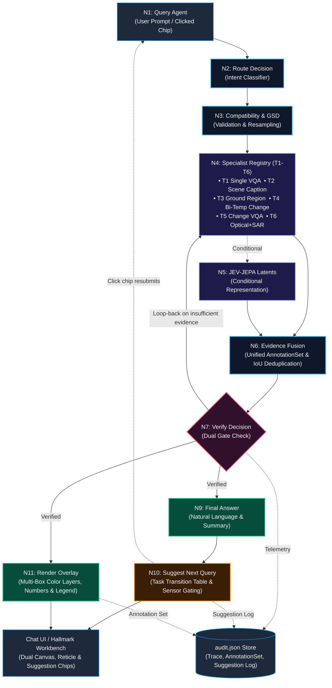

# SatQuery AI — Repository Structure & Team Walkthrough

**Welcome to SatQuery AI!**  
This walkthrough is the developer onboarding and architectural guide for all team members (**Khushal, Aryan, Madhura, Dipesh, Aakansha, Mannat**). It explains how the codebase is organized, how data flows through the end-to-end pipeline, and exactly where each team member should implement their assigned features.

---

## 1. High-Level System Architecture

SatQuery AI connects satellite imagery with natural-language question answering through a multi-stage observable pipeline:

```
┌─────────────────────────────────────────────────────────────────────────────────────────┐
│                                   END-TO-END PIPELINE                                   │
└─────────────────────────────────────────────────────────────────────────────────────────┘
                                       │
  [N1. Query Agent] ───────────────────┤ Image (GeoTIFF/PNG) + Query (Typed or Suggestion Chip)
                                       ▼
  [N2. Route Decision] ────────────────┤ Natural Language Intent Classifier & Specialist Dispatcher
                                       ▼
  [N3. Compatibility & GSD] ───────────┤ Format, CRS, GSD Scale Arbitration & Resampling
                                       ▼
  [N4. Specialist Exec (T1–T6)] ───────┤ RS-VLM, Siamese CD, SAR Fusion, Grounding DINO
                                       ▼
  [N5. JEV-JEPA Representation] ───────┤ (Conditional) Patch Latents & Cosine Distance Metric
                                       ▼
  [N6. Evidence Fusion] ───────────────┤ Builds unified AnnotationSet & IoU (≥0.50) Deduplication
                                       ▼
  [N7. Verify Decision] ───────────────┤ Verification arbitration (only loop-back gate to N4)
                                  ┌────┴───────────────────────────┐
                                  ▼                                ▼
  [N9. Final Answer] ─────────────┤ Structured Text Summary       [N11. Render Overlay] ──┤ Multi-Box Color Layers + Legend
                                  │                                (Parallel Execution)
                                  ▼
  [N10. Suggest Next Query] ──────┤ Transition Table & Sensor Gating → Suggestion Chips (Tappable to N1)
                                  ▼
  [UI & Audit Store] ─────────────┤ Hallmark Telemetry Workbench & Gradio QA | audit.json Ledger
```

### Complete Pipeline Architecture (Mermaid)



---

## 2. Directory Map & Codebase Organization

```
SATQuery/
├── PRD.md                          # Comprehensive Product Requirements Document
├── tasks.md                        # Phase-wise roadmap and task allocation matrix
├── UIrules.md                      # Hallmark anti-AI-slop design system & UI constraints
├── WALKTHROUGH.md                  # This file (Team architecture & developer guide)
├── .gitignore                      # Git ignore rules (protects weights, reports, overlays)
├── run_satquery.bat                # Windows quick-launch batch script
├── start.ps1                       # PowerShell launcher for backend + frontend
│
├── backend/                        # FastAPI Backend & Inference Engine
│   ├── main.py                     # FastAPI entrypoint, /query, /feedback, /suggestion/click
│   ├── orchestrator.py             # 11-stage pipeline orchestrator
│   ├── compatibility.py            # Pre-flight input validation & GSD arbitration
│   ├── router.py                   # Natural-language intent classifier & dispatcher
│   ├── gsd_normalizer.py           # GSD detection, resolution resampling, & scale math
│   ├── jepa_engine.py              # JEV-JEPA latent patch representation architecture
│   ├── dl_models.py                # Deep learning models (Siamese CNN, ONNX change detector)
│   ├── specialists.py              # Specialist engines (RS-VLM, Change Detection, SAR Fusion)
│   ├── annotation_schema.py        # Standardized AnnotationSet schema (T1-T6)
│   ├── evidence_fusion.py          # Node N6: Multi-layer fusion & IoU deduplication
│   ├── render_overlay.py           # Node N11: Multi-layer color overlay, numbers & legend
│   ├── next_query.py               # Node N10: Grounded follow-up recommendation engine
│   ├── audit_store.py              # Persistent audit logger (audit.json)
│   ├── audit.json                  # Append-only structured telemetry & feedback log
│   ├── serve_fine_tuned.py         # Local inference server for fine-tuned LoRA checkpoint
│   ├── evidence.py                 # Core rendering utilities and metric scale bar math
│   ├── confidence.py               # Compound confidence arbitration & calibration
│   ├── trace.py                    # Stage-by-stage observable execution telemetry builder
│   ├── report.py                   # Multi-format report export (JSON, Markdown, PDF, DOCX)
│   ├── gradio_app.py               # Standalone Gradio chat QA surface with suggestion chips
│   ├── tests/                      # Isolated unit & integration tests
│   │   ├── test_next_query.py      # Node N10 isolated unit tests
│   │   ├── test_render_overlay.py  # Node N11 & IoU deduplication unit tests
│   │   └── test_pipeline_e2e.py    # Complete pipeline end-to-end integration tests
│   ├── requirements.txt            # Python package dependencies
│   ├── weights/                    # Model weights directory (git-ignored)
│   │   ├── satquery_rsvlm_lora/    # Fine-tuned LoRA adapter safetensors & config
│   │   └── siamese_cd.onnx         # ONNX runtime weights for change detection
│   ├── static/overlays/            # Generated visual evidence overlays (git-ignored)
│   └── reports/                    # Generated query export reports (git-ignored)
│
├── frontend/                       # Client-side Geospatial Telemetry Workbench
│   ├── index.html                  # Semantic workbench UI shell (dual canvas, inspector)
│   ├── style.css                   # Hallmark-compliant CSS tokens & 8-state components
│   ├── app.js                      # Client controller: upload, polling, canvas, telemetry
│   └── samples/                    # Curated sample satellite scenes for rehearsals
│       ├── airport_runway.jpg      # High-resolution optical scene
│       ├── urban_port.jpg          # Commercial harbor scene
│       ├── farm_river.jpg          # Agricultural multi-spectral scene
│       ├── port_sar.jpg            # Sentinel-1 Synthetic Aperture Radar scene
│       ├── port_t1.jpg             # Baseline T1 change detection scene
│       └── port_t2.jpg             # Monitoring T2 change detection scene
│
└── training/                       # Specialist Model Training & Data Prep
    ├── prepare_bigearthnet.py      # Dataset pipeline for BigEarthNet & grounding pairs
    ├── finetune_rsvlm_colab.ipynb  # Colab/Jupyter notebook for QLoRA fine-tuning
    ├── build_notebook.py           # Script to generate notebook artifacts
    ├── README.md                   # Training guide & evaluation methodology
    └── data/                       # Instruction datasets (bigearthnet_vqa_grounding.json)
```

---

## 3. Team Workstream Assignments & Code Boundaries

### 🛰️ Track 1: JEV-JEPA Representation Engine
**Assignees:** Khushal & Aryan  
**Primary Files to Edit / Create:**
- [`backend/jepa_engine.py`](file:///c:/Users/nandi/Desktop/SATQuery/backend/jepa_engine.py)
- [`backend/dl_models.py`](file:///c:/Users/nandi/Desktop/SATQuery/backend/dl_models.py)
- [`backend/specialists.py`](file:///c:/Users/nandi/Desktop/SATQuery/backend/specialists.py)

**Your Core Mission:**
1. **Latent Space Representation:** Implement the Vision Transformer (ViT) patch encoder that projects satellite image patches into feature space ($d=768$) without pixel-level reconstruction.
2. **Masked Patch Prediction:** Implement context vs. target patch masking where target representations are predicted in latent embedding space.
3. **Bi-Temporal Change Metric:** For two temporal scenes ($T_1$ and $T_2$), compute the latent feature distance across aligned spatial patches. Areas with high cosine distance indicate physical changes (new infrastructure, cleared vegetation).
4. **Integration:** Connect your JEPA feature extractor into `specialists.py` and `dl_models.py` so the orchestrator can call it during inference.

---

### 🎨 Track 2: UI / UX & Hallmark Workbench
**Assignee:** Aryan  
**Primary Files to Edit / Create:**
- [`frontend/index.html`](file:///c:/Users/nandi/Desktop/SATQuery/frontend/index.html)
- [`frontend/style.css`](file:///c:/Users/nandi/Desktop/SATQuery/frontend/style.css)
- [`frontend/app.js`](file:///c:/Users/nandi/Desktop/SATQuery/frontend/app.js)
- [`UIrules.md`](file:///c:/Users/nandi/Desktop/SATQuery/UIrules.md)

**Your Core Mission:**
1. **Hallmark Anti-AI-Slop Compliance:** Strictly follow [`UIrules.md`](file:///c:/Users/nandi/Desktop/SATQuery/UIrules.md). Ensure none of the 20 banned patterns (no purple-to-blue gradients, no Inter-everywhere, no Space Grotesk/Instrument Serif, no glassmorphism, no button fade hovers) are present.
2. **Industrial Telemetry Workbench Layout:** Build the three-panel layout:
   - Left: Sensor settings, drag-and-drop imagery upload, natural-language query bar.
   - Center: Dual-canvas geospatial viewer with synchronized crosshairs, evidence overlays, and metric scale bars.
   - Right: Grounded answer panel, confidence gauge, physical dimension inspector, and report export.
   - Bottom: Collapsible observable telemetry drawer displaying stage-by-stage execution times in milliseconds.
3. **8-State Interactive Components:** Ensure every button, tab, and input implements all 8 states: `default`, `hover`, `focus-visible`, `active`, `disabled`, `loading`, `error`, and `success`.

---

### 📏 Track 3: GSD Normalisation Engine
**Assignees:** Madhura & Dipesh  
**Primary Files to Edit / Create:**
- [`backend/gsd_normalizer.py`](file:///c:/Users/nandi/Desktop/SATQuery/backend/gsd_normalizer.py)
- [`backend/compatibility.py`](file:///c:/Users/nandi/Desktop/SATQuery/backend/compatibility.py)
- [`backend/evidence.py`](file:///c:/Users/nandi/Desktop/SATQuery/backend/evidence.py)

**Your Core Mission:**
1. **GSD Metadata Extraction:** Read Ground Sampling Distance (meters per pixel) from GeoTIFF rasters (via GDAL/rasterio or metadata headers). Handle standard sensors: Sentinel-2 (10m), Landsat 8/9 (15m/30m), PlanetScope (3m), WorldView (0.3m–0.5m).
2. **Spatial Resampling:** Implement anti-aliased resampling (Lanczos or bicubic) to normalize heterogeneous input images into standard model working resolutions while preserving physical scale ratios.
3. **Scale Bar & Physical Metrics:** Compute real-world measurements from bounding boxes:
   $$\text{Physical Length} = \text{pixels} \times \text{GSD (m/px)}$$
   $$\text{Physical Area} = \text{pixel area} \times \text{GSD}^2$$
   Overlay an accurate, calibrated metric scale bar (e.g. `[— 100 m —]`) onto the evidence canvas.
4. **Compatibility Guard:** In `compatibility.py`, catch queries that attempt cross-image change detection across wildly incompatible resolutions (e.g. comparing 60m Sentinel band with 0.3m drone imagery without warning).

---

### 🧠 Track 4: Fine-Tuning & Self-Adapting Loop
**Assignees:** Aakansha & Mannat  
**Primary Files to Edit / Create:**
- [`training/prepare_bigearthnet.py`](file:///c:/Users/nandi/Desktop/SATQuery/training/prepare_bigearthnet.py)
- [`training/finetune_rsvlm_colab.ipynb`](file:///c:/Users/nandi/Desktop/SATQuery/training/finetune_rsvlm_colab.ipynb)
- [`backend/serve_fine_tuned.py`](file:///c:/Users/nandi/Desktop/SATQuery/backend/serve_fine_tuned.py)
- [`backend/main.py`](file:///c:/Users/nandi/Desktop/SATQuery/backend/main.py) (Add `POST /feedback`)
- [`backend/confidence.py`](file:///c:/Users/nandi/Desktop/SATQuery/backend/confidence.py)

**Your Core Mission:**
1. **Instruction Data Preparation:** Curate and format 200–500 instruction pairs with bounding tags `[ymin, xmin, ymax, xmax]` from BigEarthNet or RSIVQA in `training/data/`.
2. **QLoRA Fine-Tuning:** Execute 4-bit NF4 quantized LoRA fine-tuning on Qwen2-VL-7B or LLaVA-1.5 ($r=32$, $\alpha=64$). Save adapter weights to `backend/weights/satquery_rsvlm_lora/`.
3. **Local Specialist Serving:** Ensure `serve_fine_tuned.py` loads the adapter and returns structured VQA answers with normalized bounding coordinates.
4. **Self-Adapting Feedback Loop:**
   - Create `POST /feedback` endpoint in `main.py` allowing the operator to submit ratings (`accept`, `reject`, `corrected_bbox`).
   - Implement an active learning triage queue that flags low-confidence or high-entropy queries for model retraining.
   - Calibrate confidence scoring using Expected Calibration Error (ECE).

---

## 4. How to Run & Develop Locally

### Prerequisites
- Python 3.10 or higher.
- A modern web browser (Chrome, Edge, Firefox).
- Recommended: NVIDIA GPU with CUDA support for local LoRA/JEPA execution (the system will automatically fall back to CPU or Gemini/Groq API if no GPU is available).

### Setup Instructions

1. **Activate your virtual environment & install backend dependencies:**
   ```powershell
   cd c:\Users\nandi\Desktop\SATQuery\backend
   pip install -r requirements.txt
   ```

2. **Configure Environment Variables:**
   Copy `.env.example` to `.env` in the `backend/` directory and add your API keys (optional for mock, required for live vision models):
   ```env
   GEMINI_API_KEY=your_gemini_key_here
   GROQ_API_KEY=your_groq_key_here
   USE_FINE_TUNED_MODEL=false
   ```

3. **Start the Backend Server:**
   ```powershell
   cd c:\Users\nandi\Desktop\SATQuery\backend
   python -m uvicorn main:app --reload --port 8000
   ```
   Or use the root launcher:
   ```powershell
   .\run_satquery.bat
   ```

4. **Launch the Frontend Workbench:**
   Open `frontend/index.html` directly in your browser, or serve it via a lightweight local server:
   ```powershell
   cd c:\Users\nandi\Desktop\SATQuery\frontend
   python -m http.server 3000
   ```
   Then navigate to `http://localhost:3000`.

5. **Verify Backend Health:**
   Open `http://localhost:8000/health` to confirm all services and model tiers are active. Interactive API documentation is available at `http://localhost:8000/docs`.

---

## 5. Cleanliness & Repository Hygiene

To keep the repository clean and avoid git bloat:
1. **Never commit generated reports or overlays:** `backend/reports/` and `backend/static/overlays/` are git-ignored. Only `.gitkeep` should be committed.
2. **Never commit large checkpoint dumps:** Adapter weights (`backend/weights/satquery_rsvlm_lora/`) are ignored by default. Share large safetensors via team HuggingFace or cloud drive.
3. **Follow the Task Checklist:** Before starting a task, mark it as in progress in [`tasks.md`](file:///c:/Users/nandi/Desktop/SATQuery/tasks.md); once verified, check the box `[x]`.
